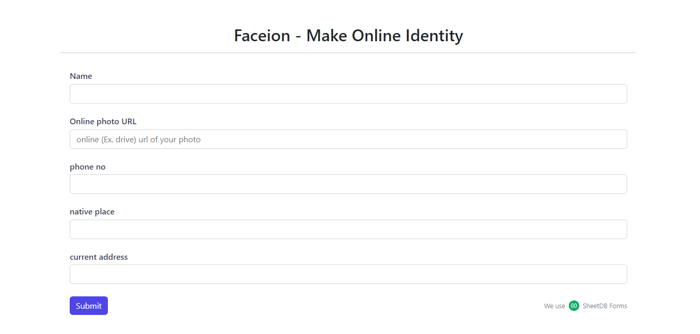

# Faceion-Online-Form_OnlineSheetDB-API

This form is created using online Google sheet API plateform <a href="https://sheetdb.io/apis" traget="_blank"> SheetDB </a> using this plateform we can generate online HTML code. we can use that code anywhere in our HTML file. when people submit their response it will save in our Google sheet. How nice is that !
  

